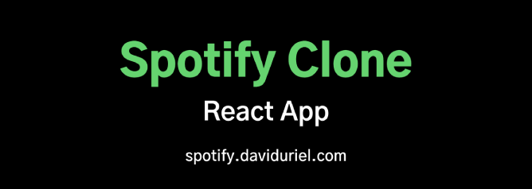
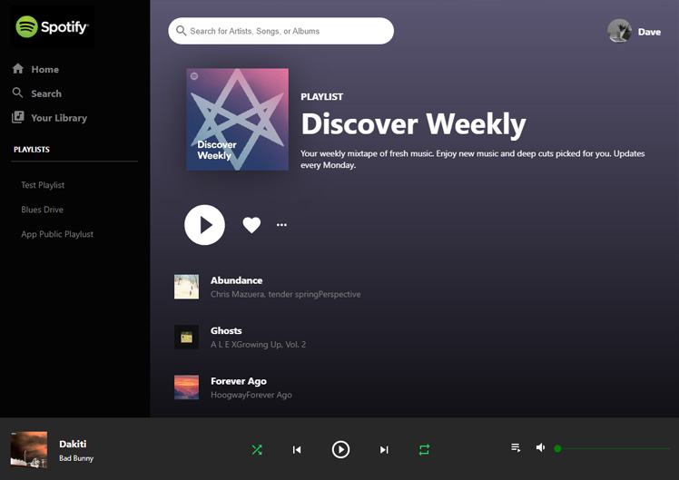

<h1 align="center">Netflix Clone React App</h1>


<h2 align="center"><a  href="https://spotify.daviduriel.com">Live Demo</a></h2>

## Description

This is a Spotify Clone that was created to mimic the style and feel of a Spotify web player. You can browse your playlists from spotify using a UI very similar to the web player.

<p align="center"></p>

## About The Project

This clone was built using React. This application uses Spotify Web API to obtain user information and playlists to show up on a mock Spotify web player.

## Future Scope

Future versions will have full functionality of the player and added support for mobile browsers.

## Project Setup

```
npm install
npm start
```
